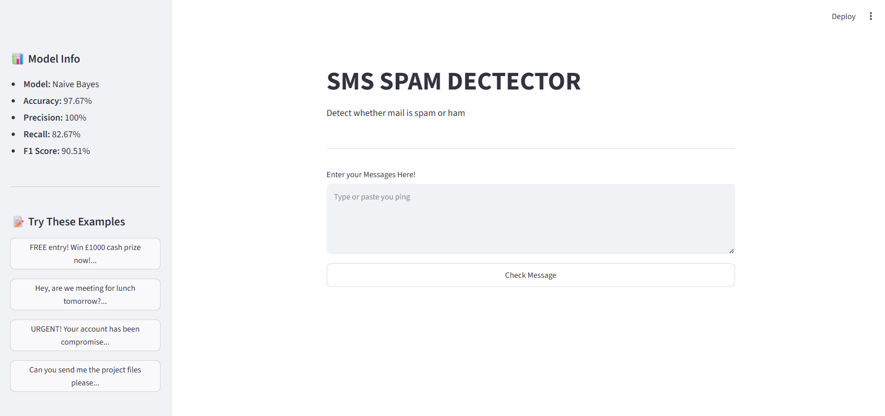

# 📱 SMS Spam Detection


A machine learning web application that detects whether an SMS message 
is **Spam** or **Ham (Not Spam)** using Natural Language Processing and Naive Bayes classification.

---

## 🎯 Problem Statement

SMS spam messages are a growing problem worldwide. This project builds 
an end-to-end machine learning pipeline that automatically classifies 
SMS messages with 97.67% accuracy.

---

## 🌐 Live Demo

> Run locally using steps below

---

## 📊 Model Performance

| Metric | Score |
|--------|-------|
| ✅ Accuracy | 97.67% |
| ✅ Precision | 100% |
| ✅ Recall | 82.67% |
| ✅ F1 Score | 90.51% |

---

## 🏗️ Project Structure
sms_spam_detection/
│
├── data/
│   ├── raw/                   # Original dataset
│   └── processed/             # Cleaned dataset
│
├── src/
│   ├── data_ingestion.py      # Load data
│   ├── data_preprocessing.py  # Clean & prepare data
│   ├── feature_engineering.py # TF-IDF vectorization
│   ├── model_trainer.py       # Train & evaluate model
│   └── predictor.py           # Predict new messages
│
├── pipeline/
│   ├── training_pipeline.py   # End-to-end training
│   └── prediction_pipeline.py # End-to-end prediction
│
├── artifacts/
│   ├── model.pkl              # Saved trained model
│   └── vectorizer.pkl         # Saved TF-IDF vectorizer
│
├── config/
│   └── config.yaml            # Project configuration
│
├── app.py                     # Streamlit web app
├── requirements.txt           # Dependencies
└── README.md                  # Project documentation

---

## 🛠️ Tech Stack

| Tool | Purpose |
|------|---------|
| Python 3.x | Core language |
| Scikit-learn | ML model |
| NLTK | Text preprocessing |
| Streamlit | Web application |
| Pandas & NumPy | Data handling |
| PyYAML | Config management |

---

## ⚙️ ML Pipeline
Raw SMS Data
↓
Data Preprocessing
(lowercase, remove punctuation, stopwords, stemming)
↓
TF-IDF Feature Extraction
(3000 features)
↓
Multinomial Naive Bayes
↓
Spam / Ham Prediction

---

## 📦 Installation & Setup

**1. Clone the repository**
```bash
git clone https://github.com/YOUR_USERNAME/sms_spam_detection.git
cd sms_spam_detection
```

**2. Create virtual environment**
```bash
python -m venv .env
.env\Scripts\activate
```

**3. Install dependencies**
```bash
pip install -r requirements.txt
```

**4. Download dataset**
- Download `spam.csv` from [Kaggle SMS Spam Collection](https://www.kaggle.com/datasets/uciml/sms-spam-collection-dataset)
- Place it inside `data/raw/` folder

---

## 🚀 Usage

**Train the model:**
```bash
python pipeline/training_pipeline.py
```

**Test predictions:**
```bash
python pipeline/prediction_pipeline.py
```

**Run web app:**
```bash
streamlit run app.py
```

Open browser at `http://localhost:8501`

---

## 🖥️ App Screenshots



---

## 📈 Key Results

- 🎯 Zero ham messages wrongly flagged as spam
- 🚨 96%+ confidence on clear spam messages  
- ⚡ Real time predictions via web interface
- 🏭 Production ready modular codebase

---

## 🔮 Future Improvements

- [ ] Add deep learning model (LSTM)
- [ ] Deploy on Streamlit Cloud
- [ ] Add more languages support
- [ ] Improve recall with data augmentation
- [ ] Add REST API with Flask/FastAPI

---

## 👨‍💻 Author

**Your Name**
- 🐙 GitHub: [@your_username](https://github.com/your_username)
- 💼 LinkedIn: [your_linkedin](https://linkedin.com/in/your_linkedin)

---

## 📄 License

This project is open source and available under the [MIT License](LICENSE).

---

⭐ If you found this helpful, please give it a star on GitHub!
